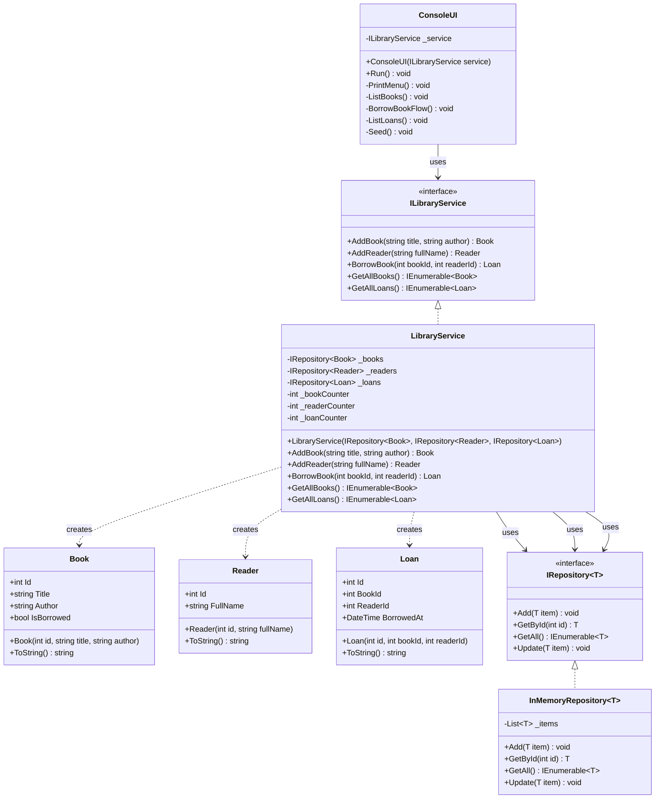

# Диаграмма классов

```mermaid
classDiagram
    class Book {
        +int Id
        +string Title
        +string Author
        +bool IsBorrowed
        +Book(int id, string title, string author)
        +ToString() string
    }

    class Reader {
        +int Id
        +string FullName
        +Reader(int id, string fullName)
        +ToString() string
    }

    class Loan {
        +int Id
        +int BookId
        +int ReaderId
        +DateTime BorrowedAt
        +Loan(int id, int bookId, int readerId)
        +ToString() string
    }

    class IRepository~T~ {
        <<interface>>
        +Add(T item) void
        +GetById(int id) T
        +GetAll() IEnumerable~T~
        +Update(T item) void
    }

    class ILibraryService {
        <<interface>>
        +AddBook(string title, string author) Book
        +AddReader(string fullName) Reader
        +BorrowBook(int bookId, int readerId) Loan
        +GetAllBooks() IEnumerable~Book~
        +GetAllLoans() IEnumerable~Loan~
    }

    class InMemoryRepository~T~ {
        -List~T~ _items
        +Add(T item) void
        +GetById(int id) T
        +GetAll() IEnumerable~T~
        +Update(T item) void
    }

    class LibraryService {
        -IRepository~Book~ _books
        -IRepository~Reader~ _readers
        -IRepository~Loan~ _loans
        -int _bookCounter
        -int _readerCounter
        -int _loanCounter
        +LibraryService(IRepository~Book~, IRepository~Reader~, IRepository~Loan~)
        +AddBook(string title, string author) Book
        +AddReader(string fullName) Reader
        +BorrowBook(int bookId, int readerId) Loan
        +GetAllBooks() IEnumerable~Book~
        +GetAllLoans() IEnumerable~Loan~
    }

    class ConsoleUI {
        -ILibraryService _service
        +ConsoleUI(ILibraryService service)
        +Run() void
        -PrintMenu() void
        -ListBooks() void
        -BorrowBookFlow() void
        -ListLoans() void
        -Seed() void
    }

    IRepository~T~ <|.. InMemoryRepository~T~
    ILibraryService <|.. LibraryService
    LibraryService --> IRepository~Book~ : uses
    LibraryService --> IRepository~Reader~ : uses
    LibraryService --> IRepository~Loan~ : uses
    LibraryService ..> Book : creates
    LibraryService ..> Reader : creates
    LibraryService ..> Loan : creates
    ConsoleUI --> ILibraryService : uses
```