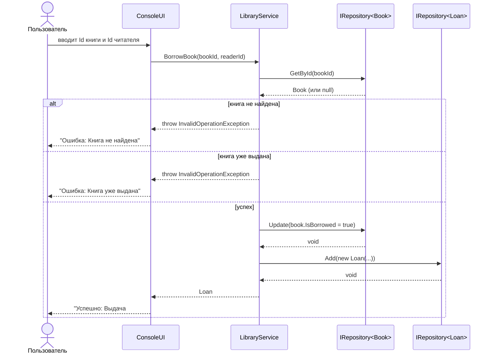

# Диаграмма последовательности: выдача книги

Ключевой сценарий: читатель берёт книгу в библиотеке.

```mermaid
sequenceDiagram
    actor User as Пользователь
    participant UI as ConsoleUI
    participant Svc as LibraryService
    participant BookRepo as IRepository<Book>
    participant LoanRepo as IRepository<Loan>

    User->>UI: вводит Id книги и Id читателя
    UI->>Svc: BorrowBook(bookId, readerId)
    Svc->>BookRepo: GetById(bookId)
    BookRepo-->>Svc: Book (или null)
    alt книга не найдена
        Svc-->>UI: throw InvalidOperationException
        UI-->>User: "Ошибка: Книга не найдена"
    else книга уже выдана
        Svc-->>UI: throw InvalidOperationException
        UI-->>User: "Ошибка: Книга уже выдана"
    else успех
        Svc->>BookRepo: Update(book.IsBorrowed = true)
        BookRepo-->>Svc: void
        Svc->>LoanRepo: Add(new Loan(...))
        LoanRepo-->>Svc: void
        Svc-->>UI: Loan
        UI-->>User: "Успешно: Выдача #N ..."
    end
```